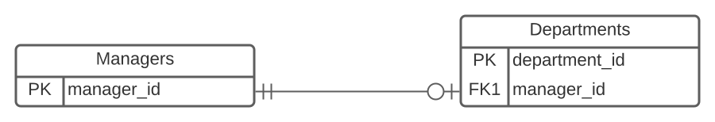
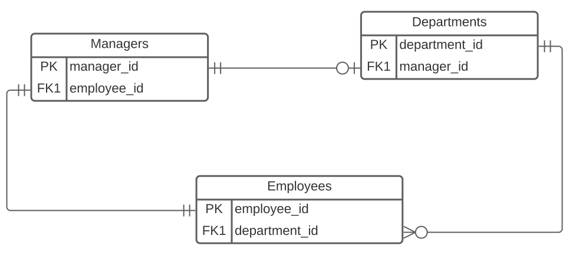
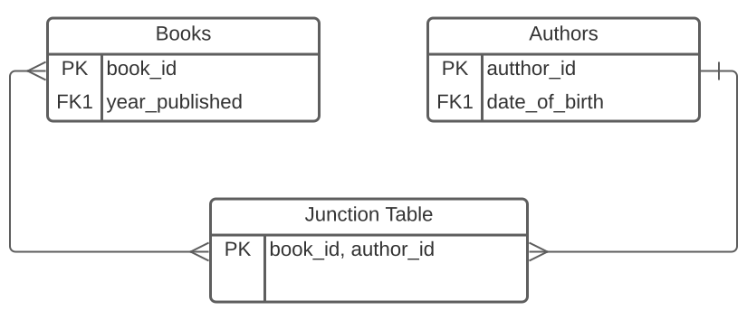

- [Introduction to Databases](#introduction-to-databases)
  - [Tables](#tables)
    - [Field Constraints](#field-constraints)
  - [Data Types](#data-types)
  - [Relational Schemas](#relational-schemas)
    - [Entity-Relationship Diagram](#entity-relationship-diagram)
    - [Schema Diagram](#schema-diagram)
    - [Keys](#keys)
- [Database Relationships](#database-relationships)
  - [One-to-One](#one-to-one)
  - [One-to-Many](#one-to-many)
  - [Many-to-Many](#many-to-many)
- [Data Definition Language (DDL)](#data-definition-language-ddl)
  - [Creating Tables](#creating-tables)
  - [Modifying Columns](#modifying-columns)
- [Data Manipulation Language (DML)](#data-manipulation-language-dml)
  - [Inserting Data](#inserting-data)
  - [Updating Data](#updating-data)
  - [Deleting Data](#deleting-data)
- [Data Control Language (DCL)](#data-control-language-dcl)
- [Transaction Control Language (TCL)](#transaction-control-language-tcl)
- [Queries](#queries)
  - [Handling `NULL` Values](#handling-null-values)
  - [Ordering Results](#ordering-results)
  - [Limiting Results](#limiting-results)
  - [Field Aliases](#field-aliases)
  - [Concatenation](#concatenation)
    - [String Concatenation](#string-concatenation)
    - [Field Concatenation](#field-concatenation)
  - [`UNION`, `INTERSECT`,  and `EXCEPT`](#union-intersect--and-except)
- [Aggregate Functions](#aggregate-functions)
  - [Grouping Results](#grouping-results)
  - [Filtering Groups](#filtering-groups)
- [Joins](#joins)
  - [Inner Joins](#inner-joins)
  - [Left/Right Joins](#leftright-joins)
  - [Full Joins](#full-joins)
  - [Multiple Joins](#multiple-joins)
- [Subqueries](#subqueries)
  - [Uncorrelated Subqueries](#uncorrelated-subqueries)
  - [Correlated Subqueries](#correlated-subqueries)

---

# Introduction to Databases

Structured Query Language (SQL) is a declarative programming language that allows you to create,manipulate, and share data specifically from Relational Database Management Systems (RDBMS).

**Database:** Systematic collection of data.  Their main goal is to organize large amounts of data that can be quickly retrieved. They must **compact, well-structured, and efficient**.

- Data is stored in table records, not individual cells.
- All calculations and operations are done after data retrieval.

**Database Management System (DBMS):** A collection of programs that enables users to access a database, munipulate data, and helps in the representation of data.  It also helps control access to the database by various users.

**Query:** Piece of code inducing the computer to execute a certain operation that will deliver the desired output.

**Entity:** The smallest unit that can contain a meaningful set of data - e.g. a row (record) in a table represents its horizontal entity and a column (field) its vertical entity.

## Tables

Contain **fields** (columns) and **records** (rows) of data.

- Each field has a defined data type.
- Each field should contain only one value per record.
- Each row of data should be unique.

### Field Constraints

1. `UNIQUE`: Ensures that a field can only contain unique values.  Throws an error if a field contains duplicate values.
2. `NOT NULL`: Ensures that  a field cannot constain `NULL` values.
3. `SET DEFAULT`: Assigns a particular default value to every record in a field.  A value different from the default can be stored in the field only if it is specifically indicated.
4. `CHECK`:  Ensures that data in a field satisfies a specific `BOOLEAN` expression.

## Data Types

See [here](https://www.postgresql.org/docs/13/datatype.html) for a full list of PostgeSQL data types.  The most common ones can be found below:

| Type | Description | Examples |
|-|-|-|
| `INT` | Whole number | Age, quantity |
| `NUMERIC(P,S)` | Arbitrary-precision numbers with P significant digits and S decimal places. | Height, price |
| `SERIAL` | Auto-incrementing integers | Not true types, merely notational convenience for creating unique id columns |
| `CHAR(N)` | Fixed length string of length N | Gender, state |
| `VARCHAR(N)` | Varying length string of max length N | Name, email |
| `TEXT` | Varying length string with no max length | Comments, reviews |
| `TIME` | HH:MM:SS | In military format |
| `DATE` | YYYY-MM-DD |  |
| `TIMESTAMP` | YYYY-MM-DD HH:MM:SS | Order time |
| `BOOLEAN` | True or false | In stock |
| `ENUM` | Values belonging to a user-defined list | Day of the week |

## Relational Schemas

Database designers will plot the entire database system using two common methods.

### Entity-Relationship Diagram


### Schema Diagram


### Keys

**Primary Key:** A field (or set of fields) whose value exists and is unique for every record in a table.

- The PK is the **unique identifier of a table** .  A table can have at most one PK
- The PK field(s) cannot contain `null` values

**Foreign Key:** A field (or set of fields) in one table, that refers to the primary key in another table.  The table with the FK is called the child table, and the table with the PK is called the parent table.

- FK's identify relationships between tables
- Preserve data integrity (cannot enter a value in the FK field that has not been declared in the parent table)

**Unique Key:**  Unique keys ensure that all values in a fiels are different.  A PK automatically has a unique constraint on it.

- May contain `null` values
- A table may have multiple unique keys

---

# Database Relationships

Database relationships are associations between tables that are created using join statements to retrieve data.  In the following schema diagrams, we will use the following notation taken from [here](https://datanomix.wordpress.com/2017/12/07/relational-model-erd-crows-foot/).


## One-to-One

Each PK value contains exactly one record that relates to zero or one record in the related table's FK field.  Both tables can have at most one record on each side of the relationship.




*Managers information is kept in a separate table from the Departments table. Each manager oversees exactly one department (yes, some departments may have no manager).  In turn, each department can have at most one manager. Hence there is a maximum of one record on each side of the relationship.*

## One-to-Many

The primary key table contains only one record that relates to none, one, or many records in the related table.



*Each department can have zero, one, or many employees.  In turn, employees can only work in exactly one department.*

## Many-to-Many

Multiple records in one table are associated with multiple records in another table.  These relationships are usuallly reflected in a **junction table** which essentially has the **unique combinations** of all records as PK.



*A book may have multiple authors and an author may write multiple books.  So what is unique is the book-author combinations, which are reflected in the junction table's PK.*

---

# Data Definition Language (DDL)

To connect to your local database using from the command line, use the command `psql -U postgres -h localhost database_name`.  To connect to a specific database while already in psql, simply use the meta command `\c database_name`.

To create a new database use the following command:

```sql
CREATE DATABASE database_name;
```

DDL is composed of statements that allow us to define or modify data structures and objects (e.g. the `CREATE` statement).

```sql
-- create a table with a single column
CREATE TABLE SALES_DATA(purchase_number INT);

-- add another column to it
ALTER TABLE sales_data
ADD COLUMN date_of_purchase DATE;

-- rename the table
rename TABLE sales_data TO sales;

-- delete the table
DROP TABLE sales;

-- alternatively, just empty the table
TRUNCATE TABLE sales;
```

## Creating Tables

```sql
-- Parent table
CREATE TABLE DIRECTORS( director_id SERIAL PRIMARY KEY,
                        first_name VARCHAR ( 30 ),
                        last_name VARCHAR ( 30 ) NOT NULL,
                        date_of_birth DATE,
                        nationality VARCHAR ( 20 ) );

-- Child table
CREATE TABLE MOVIES( movie_id serial PRIMARY KEY,
                     movie_name VARCHAR ( 50 ) NOT NULL,
                     movie_length INT,
                     release_date DATE,
                     -- FOREIGN KEY field
                     director_id INT REFERENCES DIRECTORS(director_id) );
```

A **junction table** maps two or more tables together by referencing the PK's of each data table. It contains a number of foreign keys, each in a many-to-one relationship from the junction table to the individual data tables. The PK of the junction table is typically composed of the FK columns themselves.

```sql
CREATE TABLE MOVIES_ACTORS( movie_id INT REFERENCES MOVIES(movie_id),
                            actor_id INT REFERENCES ACTORS(actor_id),
                            PRIMARY KEY ( movie_id, actor_id ) );
```

## Modifying Columns

To add a column we use the `ALTER` statement to add a column.  As always, we have to define the field's data type and contatraints at the time of creation.

```sql
ALTER TABLE directors
ADD COLUMN email VARCHAR ( 50 ) UNIQUE,
ADD COLUMN age INT NOT NULL;
```

To modify a field's data type, you use the `ALTER` keyword both on the table and the column along with the  `TYPE` keyword.

```sql
ALTER TABLE directors
ALTER COLUMN nationality TYPE CHAR ( 3 ),
ALTER COLUMN last_name TYPE VARCHAR ( 50 );
```

Adding constraints on a field after its creation is a little bit more tricky and should be avoided through appropiate design.  For more information on how to do it [see here](https://www.cockroachlabs.com/docs/stable/add-constraint.html).

---

# Data Manipulation Language (DML)

Statements that allow us to manipulate the data in a database (e.g. the `SELECT` statement is used to retrieve data from database objects).  We will ommit DML related to queries since this topic has its own section.

```sql
-- retrieve entire table
SELECT *
FROM sales;

-- insert data into table
-- equivalent to INSERT INTO sales (purchase_number, date_of_purchase) VALUES (001, '2021-10-11');
INSERT INTO sales
VALUES ( 001, "2021-10-11" );
UPDATE sales
SET date_of_purchase_ = "2020-12-12"
WHERE purchase = 1;
```

While the `TRUNCATE` statement removes all the records contained in the table, `DELETE` allows us to specify precisely what you would like removed.

```sql
DELETE FROM sales
WHERE purchase_number = 1;
```

## Inserting Data

To insert records into a table, follow the following template:

```sql
INSERT INTO TABLENAME(colname1, colname2, ...)
VALUES ( value1, value2, ... );
```

If you are adding a value to every column in the table you can use shorthand notation by omitting the column names in the query above.  However, keep in mind that while we don't insert values into  `SERIAL` columns, they are still a column in the table so we do have to specify that we are only adding values to all the other columns only and cannot use the shorthand notation.

```sql
-- the first col in this table is the id which is a serial
-- the query specifies the values are going to all other columns
INSERT INTO OWNERS(first_name, last_name, city, province)
VALUES ( 'Paula', 'Amaya', 'Toronto', 'ON' ),
       ( 'Claudia', 'Amaya', 'Toronto', 'ON' ),
       ( 'Bob', 'Smith', 'Vancouver', 'BC' ),
       ( 'Fanny', 'Lu', 'Montreal', 'QC' );
```

## Updating Data

To update data in a table, follow the following template:

```sql
UPDATE tablename
SET colname = newvalue
WHERE colname = somevalue;
```

When targeting a specific record, it's usually a good idea to use the PK as the `WHERE` clause because you know that is a unique entry in the record.

```sql
UPDATE owners
SET city = 'Leduc',
    province = 'AB'
WHERE id = 2;
```

## Deleting Data

To delete targeted data in a table, follow the following template:

```sql
DELETE FROM tablename
WHERE colname = somevalue;
```

You can delete multiple records at a time, as long as they meet the `WHERE` clause.

```sql
-- remove all Oakville records
DELETE FROM owners
WHERE city = 'Oakville';
```

- `DROP`: Dropping a table you will wipe out its records, the table as a structure, and any related objects like indexes. Dropping is absolutely final and cannot be undone by a rollback.
- `TRUNCATE`: Truncating a table will wipe out all the records in the table but the structure (data types, constraints, etc.) will remain intact.  Serial values will reset to their default starting value.
- `DELETE`: Removes records row by row according to the `WHERE` condition.  If this condition is omitted, it will have the same effect as truncating (only much less efficient since it's done row-by-row). **Serial values are not reset with `DELETE`**.

---

# Data Control Language (DCL)

Statements that allow us to manage the rights users have in a database.  You can `GRANT` or `REVOKE` priviledges to users.  Both of these keywords have identical syntax.

```sql
-- GRANT syntax
GRANT permission_type ON database_name.table_name 
TO "username" @ "localhost"

-- the user Frank can only SELECT
-- and only from the customers table in the database
CREATE USER "frank" @ "localhost" identified BY "password";

GRANT SELECT ON sales.customers 
TO "frank" @ "localhost";
```

---

# Transaction Control Language (TCL)

The `COMMIT` statement will save the changes you've made, allowing other users to access the modified version.  It only works with changes related to the DML keywords `INSERT`, `DELETE`, and `UPDATE`.

```sql
UPDATE customers
SET last_name = "Johnson"
WHERE customer_id = 4 COMMIT;
```

The `COMMIT` statement is used to save the state of the data in the database at the moment of its execution.  

Meanwhile, `ROLLBACK` will allow you to revert back to the last commit; all uncomitted changes will be discarded.  However, you cannot restore data to an state earlier than the last commit. 

---

# Queries

We can retrieve entire columns, and these are simplest queries we can make.

```sql
SELECT * FROM actors;

SELECT first_name,
       last_name
FROM actors;
```

We can use a `WHERE` clause to filter the results of a query even further:

```sql
SELECT movie_name
FROM movies
WHERE age_certificate = '18'
      AND release_date > '1999-12-31'
      AND movie_length >= 120;
```

The examples above illustrate querying records where a field is equal to a specific value.  We can also query records where a field has a value `IN` or `NOT IN` an accepting set of values.

```sql
SELECT movie_name
FROM movies
WHERE age_certificate IN ( '15', '18' )
      AND movie_lang NOT IN ( 'English', 'Chinese' );
```

We can also use some baby regex to query records through pattern matching, using the `LIKE` statement.

- `%` any (including zero) number of arbitrary characters
- `_` exactly one arbitrary character

```sql
-- returns all records of actors who names begin with M or end in 'la'
SELECT *
FROM actors
WHERE first_name LIKE 'M%'
      OR first_name LIKE '%la';
```

We can also use the `BETWEEN` statement to query in an **inclusive** range.

```sql
SELECT first_name,
       last_name
FROM directors
WHERE nationality IN ( 'British', 'German', 'French' )
      AND date_of_birth BETWEEN '1950-01-01' AND '1980-12-31';
```

> **Operator Precedence**
>
>In the execution of a query, the operator `AND` is applied first and the operator `OR` second.  To circumvent problems, make it a practice to use appropiate parantheses.

## Handling `NULL` Values

In some cases it may be inconvenient to deal with null values in your queries.  For example, `INT` + `NULL` = `NULL` which could cause some problems. Additionally, you may wish to indicate empty values in your results with a string on specific number instead of just null.

The `COALESCE` function accepts an unlimited number of arguments. It returns the first argument that is not null. If all arguments are null, the `COALESCE` function will return `NULL`.

Notice how this function allows us to refine the query below:

```sql
SELECT movie_id,
       COALESCE(domestic_takings, 0),
       COALESCE(international_takings, 0),
       -- prevents summation from resulting in NULL
       ( COALESCE(domestic_takings, 0) + COALESCE(international_takings, 0) ) AS total_takings
FROM movie_revenues;
```

It is important to note that `COALESCE` does not impact the structure of the table, it simply helps to improve query results.  See another example below:

```sql
SELECT COALESCE(first_name, 'First name not provided') AS first_name,
       COALESCE(last_name, 'Last name not provided') AS last_name
FROM actors;
```

## Ordering Results

You can order the results produced by a query according to a filed other than the id.  To do so, use the following syntax:

```sql
SELECT colname1,
       colname2
FROM tablename
ORDER BY colname3;
```

For instance to see a table ordered, not by primary key, but by the first names in the records you could do the following query,

```sql
SELECT *
FROM actors
ORDER BY first_name;
```

The default ordering is in ascending order, but if you want it in descending order you just have to specify this using the `DESC` keyword.

```sql
SELECT *
FROM actors
ORDER BY first_name DESC;
```

> `NULL` is considered the **highest** value.  So be careful when ordering records in descending order since null values will show up at the top.
> In these cases it is useful to include a `IS NOT NULL` statement in the query.
> 

## Limiting Results

You can set an upper bound for the number of records you want the query to return with a `LIMIT` clause.  

Suppose you want to query the three movies with the lowest domestic  and the three movies with the highest domestic revenues.  The query would look like this:

```sql
-- Three lowest revenues
SELECT *
FROM movie_revenues
ORDER BY domestic_takings
LIMIT 3;

-- Three highest revenues
SELECT *
FROM movie_revenues
WHERE domestic_takings IS NOT NULL
ORDER BY domestic_takings DESC
LIMIT 3;
```

We can also offset the limit clause.  The `OFFSET`  clause skips the offset rows **inclusively** before beginning to return the rows. If you use both `LIMIT` and `OFFSET` clauses, the OFFSET skips offset rows first before the LIMIT constrains the number of rows.

```sql
-- Returns actors with id 6-10 only
SELECT *
FROM actors
ORDER BY actor_id
LIMIT 5 OFFSET 5;
```

You can also use a `FETCH` to return a certain number of rows of data.  The syntax is as follows:

```sql
SELECT col1,
       col2
FROM table_name
FETCH FIRST X ROW ONLY;
```

So an equivalent alternative to the queries above would be,

```sql
-- Return the three movies with the lowest revenue
SELECT *
FROM movie_revenues
ORDER BY domestic_takings
FETCH FIRST 3 ROW ONLY;

-- Returns actors with id 6-10 only
SELECT *
FROM actors
ORDER BY actor_id
OFFSET 5
FETCH NEXT 5 ROW ONLY;
```

You can also query in a way that only returns the distinct values in a field.  For instance if we query the `movie_lang` column in our `MOVIES` table, we get a bunch of repeated rows.  To prevent repeated data, use the `DISTINCT` keyword.

```sql
SELECT DISTINCT movie_lang
FROM movies
ORDER BY movie_lang;
```

You can also query **distinct combinations of fields**.  Continuing our example, you could query the distinct comnbinations of movie languages and ratings,

```sql
SELECT DISTINCT movie_lang, age_certificate
FROM movies
ORDER BY movie_lang;
```

## Field Aliases

You can rename a column in the results set.  For example you may want to temporarily rename a column in a query for clarity purposes.  The syntax is as follows:

```sql
SELECT colname AS alias
FROM table_name;
```

> **Note:** Because of the order SQL is compiled in, the column alias will be recognized by the `ORDER` statement, but not the `WHERE` clause.
>
>It is good practice to just use the orginal field name whenever possible and reserve the alias for display clarity only.

## Concatenation

```sql
SELECT CONCAT_WS(' ', colname1, colname2) AS new_colname
FROM table_name;
```

### String Concatenation

We can do basic string concatenation.  The syntax for this is:

```sql
SELECT 'string1' || 'string2' AS new_string;
```

```sql
SELECT 'hello' || ' ' || 'world!' AS hello_world;
```

to produce the string `hello world!`.  This isn't particularly useful, but the following sections will build on this idea of concatenation.

### Field Concatenation

You may want to concatenate fields and give their result an alias.  The syntax for this is:

```sql
SELECT CONCAT(colname1, colname2) AS new_colname
FROM table_name;
```

This does not change the strucutre of the table.  It just the data of various columns as a single column.

For instance, we commonly want to concatenate first name and last name fields into a single field.  You can do this by means of the following query:

```sql
SELECT CONCAT(first_name, last_name) AS full_name
FROM actors
WHERE first_name LIKE 'A%'
ORDER BY last_name;
```

The `CONCAT` keyword concatenates data witout any separator character.  To add a separator charater use the `CONCAT_WS` which works exactly the same but takes in a separator character as its first argument. See the improved query below.

```sql
SELECT CONCAT_WS(' ', first_name, last_name) AS full_name
FROM actors
WHERE first_name LIKE 'A%'
ORDER BY last_name;
```

## `UNION`, `INTERSECT`,  and `EXCEPT`

This operator combines the result-set of two or more `SELECT` queries.

```sql
SELECT col1, col2 FROM table1
UNION
SELECT col1, col2 FROM table2
```

- Every `SELECT` statement must have the same number of columns.
- The corresponding columns must have similar data types.
- The columns in every SELECT statement must also be in the same order.

```sql
SELECT first_name, last_name
FROM ACTORS
WHERE date_of_birth BETWEEN '1960-01-01' AND '1969-12-12'
UNION
SELECT first_name, last_name
FROM DIRECTORS
WHERE date_of_birth BETWEEN '1960-01-01' AND '1969-12-12'
ORDER BY last_name;
```

> **Note:** By default, the `UNION` statement removes duplicate values.  If you want to allow for duplicates, you can use the `UNION ALL` statement which works exactly in the same way and does not remove duplicates.


The `INTERSECT` keyword works in the exact same way as `UNION`, but it only returns the entries that are common to all queries.

```sql
-- Actors who are both actors and directors
SELECT first_name, last_name
FROM ACTORS
INTERSECT
SELECT first_name, last_name
FROM DIRECTORS
ORDER BY first_name;
```

The `EXCEPT` keyword works returns the compliment of Table B.  For instance, the query below returns all the actors who are NOT directors - so the compliment of the directors table.

```sql
SELECT first_name, last_name
FROM ACTORS
EXCEPT
SELECT first_name, last_name
FROM DIRECTORS;
```

---

# Aggregate Functions

Aggregate functions peform a calculation on column data and return as single row containing the result.  They ignore `NULL` values unless told not to.

> Before discussing aggregate functions, it is worth mentioning the `ROUND(num, decimal_places)` function, which takes in a numeric value and an optional number of decimal places to round to.  It is usually applied to the single values that aggregate functions return.

The `COUNT` function returns the **number of non-null records in a field**.  It follows the following syntax:

```sql
SELECT COUNT(colname)
FROM table_name;
```

So for example we could use this function to see how many movies in our database are in English.

```sql
SELECT COUNT(*)
FROM movies
WHERE movie_lang = 'English';
```

The `SUM` function **adds all numeric values in a field**.  The syntax is the following:

```sql
SELECT SUM(colname)
FROM table_name;
```

We could use this function to see the total domestic takings of all movies that made more than 100M.

```sql
SELECT SUM(domestic_takings)
FROM movie_revenues
WHERE domestic_takings >= 100.0;
```

The `MAX` and `MIN` functions return exactly what you would expect.  The syntax is as follows:

```sql
SELECT MAX(colname)
FROM table_name;
```

The `AVG` function returns the mean value in a field.  The syntax is as follows:

```sql
SELECT AVG(colname)
FROM table_name;
```

## Grouping Results

So far we have just been using aggregate functions to return a value accross the entire field.  But it would be more useful to apply aggregate functions across **distinct entries in a field**.

The `GROUP BY` statement groups records that have the same value in a field and displays them as "summary" rows.  This **must be placed immeditely after `WHERE` and before `ORDER BY`**.  Since in most cases, when you need an aggregate function you must group the results too, it commonly follows the following syntax:

```sql
SELECT colname1, AGG(colname3)
FROM table_name
WHERE ...
GROUP BY colname1
ORDER BY colname1;
```

> **Pro Tip:** Always include the field you have grouped your results by in the `SELECT` statement and order by that field (optional).

For instance, say you want to count the number of movies per language that appear in your database:

```sql
SELECT movie_lang,
       COUNT(*)
FROM movies
GROUP BY movie_lang
ORDER BY movie_lang;
```

movie_lang  | count
------------| -------
 Chinese    |     5
 English    |    38
 German     |     1
 Japanese   |     4
 Korean     |     1
 Portuguese |     2
 Spanish    |     1
 Swedish    |     1

You can take a look at the oldest birthdate of actors per gender:

```sql
SELECT gender,
       MIN(date_of_birth)
FROM actors
GROUP BY gender;
```

 gender |    min     
--------|------------
 M      | 1901-02-01
 F      | 1913-11-05

You can also **group by distinct combinations of field values**.  Suppose you want the average movie length per language-rating combination.  The query would look like this:

```sql
SELECT movie_lang,
       age_certificate,
       AVG(movie_length) AS avg_length
FROM movies
GROUP BY movie_lang,
         age_certificate
ORDER BY movie_lang;
```

 movie_lang | age_certificate |      avg_length      
------------|-----------------|----------------------
 Chinese    | 12              | 124.0000000000000000
 Chinese    | 15              | 113.0000000000000000
 English    | 12              | 132.7142857142857143
 English    | U               |  98.2500000000000000
 English    | PG              | 124.0000000000000000
 English    | 15              | 136.5000000000000000
 English    | 18              | 125.0000000000000000
 German     | 15              | 165.0000000000000000
 Japanese   | U               | 113.5000000000000000
 Japanese   | 18              | 109.5000000000000000
 Korean     | 18              | 130.0000000000000000
 Portuguese | 18              | 145.0000000000000000
 Portuguese | 15              | 140.0000000000000000
 Spanish    | PG              |  98.0000000000000000
 Swedish    | 15              | 128.0000000000000000

 One more fun query that gives us the min and max length of English movies per age certificate!

 ```sql
SELECT age_certificate,
       MIN(movie_length) AS shortest,
       MAX(movie_length) AS longest
FROM movies
WHERE movie_lang = 'English'
GROUP BY age_certificate
ORDER BY age_certificate DESC;
 ```

 age_certificate | shortest | longest 
-----------------|----------|---------
 U               |       87 |     120
 PG              |      112 |     150
 18              |      112 |     132
 15              |      115 |     168
 12              |      104 |     149

## Filtering Groups

We would like to be able to filter group data in the same way that we filter individual records.  The `HAVING` clause is like `WHERE` but operates on grouped records returned by a `GROUP BY`.

- `HAVING` filters summarized group records.  **Only the groups that meet the `HAVING` criteria will be returned**.
- `WHERE` filters individual records. **Only the records that meet the `WHERE` criteria will be returned**.
- `HAVING` requires that a `GROUP BY` clause is present.
- Both `WHERE` and `HAVING` can be used in the same query at the same time.

It is important that the syntax be in the right order.  Here is an example of a query using all the tools we've discussed so far:

```sql
SELECT colname1,
       AGG(colname2)
FROM table_name
WHERE condition1
GROUP BY colname1
HAVING AGG(colname2) condition2
```

We may wish to look at the average rating of adult movies (15+) per language.  Which languages have an average age certificate strictly higher than 15?  The following query gives us what we need:

```sql
SELECT movie_lang,
       AVG(CAST(age_certificate AS INT)) AS avg_rating,
       COUNT(*) AS num_adult_movies
FROM movies
-- WHERE : Filter table records
WHERE age_certificate IN ( '15', '18' )
GROUP BY movie_lang
-- HAVING : Filter 
HAVING AVG(CAST(age_certificate AS INT)) > 15
ORDER BY avg_rating DESC;
```

movie_lang |     avg_rating      | num_adult_movies 
------------|---------------------|------------------
 Korean     | 18.0000000000000000 |                1
 Japanese   | 18.0000000000000000 |                2
 Portuguese | 16.5000000000000000 |                2
 English    | 15.7500000000000000 |               16

 ---

 # Joins

Joint queries allow us to retireve data from multiple tables.  We can join two tables together when there are related columns of data between the two tables - usually PK's in one table and FK's in another, but not necessarily.  We just need to join tables through a related field.

The basic strucutre of a join is as follows.  Notice that we can use **table aliases** to make the query more concise:

```sql
SELECT      a.colname1, b.colname2,...
FROM        left_table AS a
____ JOIN   right_table AS b
ON          a.related_col = b.related_col;
```

## Inner Joins

An inner join produces the set of records that match Table A and Table B.  An inner join has **no `NULL` values**.

```sql
SELECT  dir.director_id
       ,dir.first_name
       ,dir.last_name
       ,dir.nationality
       ,mov.movie_name
FROM directors AS dir
INNER JOIN movies AS mov
ON dir.director_id = mov.director_id
ORDER BY dir.first_name 
FETCH FIRST 10 ROW ONLY;
```

 director_id | first_name |        last_name         | nationality  |                movie_name
-------------|------------|--------------------------|--------------|-------------------------------
15 | Ang        | Lee                      | Chinese      | Crouching Tiger Hidden Dragon
15 | Ang        | Lee                      | Chinese      | Life of Pi
16 | Bruce      | Lee                      | Chinese      | Way of the Dragon
23 | Chan-wook  | Park                     | South Korean | Oldboy
20 | Fernando   | Meirelles                | Brazilian    | City of God
11 | Florian    | Henckel von Donnersmarck | German       | The Lives of Others
9  | Francis    | Ford Coppola             | American     | Apocalypse Now
17 | George     | Lucas                    | American     | Star Wars: Return of the Jedi


> Inner joins do not need to have equality to join the fields, we can use `<`,`>`,`<>`.

## Left/Right Joins

A left join produces all the records from the left table with matching records in the right table.  If no record is available in the right table, then the **right side will contain `NULL` values**.

```sql
SELECT
    dir.director_id,
    dir.first_name,
    dir.last_name,
    dir.nationality,
    mov.movie_name
FROM
    directors AS dir
    LEFT JOIN movies AS mov ON dir.director_id = mov.director_id
ORDER BY
    dir.first_name
FETCH FIRST
    10 ROW ONLY;
```

 director_id | first_name |        last_name         | nationality  |                movie_name
-------------|------------|--------------------------|--------------|-------------------------------
15 | Ang        | Lee                      | Chinese      | Crouching Tiger Hidden Dragon
15 | Ang        | Lee                      | Chinese      | Life of Pi
16 | Bruce      | Lee                      | Chinese      | Way of the Dragon
23 | Chan-wook  | Park                     | South Korean | Oldboy
38 | Christopher  | Nolan                   | British | 
20 | Fernando   | Meirelles                | Brazilian    | City of God
11 | Florian    | Henckel von Donnersmarck | German       | The Lives of Others
9  | Francis    | Ford Coppola             | American     | Apocalypse Now

Notice that Chistopher Nolan now appears! This is because his director id has a record in the left table, so despite it having no matching record in the right table, the join includes it.

> We can always clean up our query so that instead of a `NULL` in the right side, we get some sort of message.
> ```sql
> SELECT
>    dir.director_id,
>    dir.first_name,
>    dir.last_name,
>    dir.nationality,
>    COALESCE(mov.movie_name, 'N/A')
>FROM
>    directors AS dir
>    LEFT JOIN movies AS mov ON dir.director_id = mov.director_id
>ORDER BY
>    dir.first_name
>FETCH FIRST
>    10 ROW ONLY;
> ```

A right join produces all the records from the right table with matching records in the left table.  If no record is available in the left table, then the **left side will contain `NULL` values**.

## Full Joins

Full outer join produces the set of all records in both tables, matching records
from both sides where available. If there is no match, **the missing side will contain `NULL`**.

## Multiple Joins

To join more than 2 tables, we just need to add an additional `JOIN` staement in the query.  You can think of it as chaining the joins - Table A is chained to Table B which is chained to Table C, and so on.

```sql
SELECT
    dir.first_name,
    dir.last_name,
    mov.movie_name,
    rev.domestic_takings,
    rev.international_takings
FROM
    DIRECTORS as dir
    INNER JOIN MOVIES AS mov ON dir.director_id = mov.director_id
    INNER JOIN MOVIE_REVENUES AS rev ON mov.movie_id = rev.movie_id;
```

These triple joins are commonly used for when you cannot join two tables directly, but must do so through a junction table.  Essentially, you use the junction table as the "missing link" between two seemingly unrelated tables.

Notice that in the exaple below, the values in the junction table are only used to link the two tables and are not actually displayed in the query results:

```sql

SELECT
    ac.first_name,
    ac.last_name,
    mov.movie_name
FROM
    ACTORS AS ac
    INNER JOIN MOVIES_ACTORS AS ma ON ac.actor_id = ma.actor_id
    INNER JOIN MOVIES AS mov ON ma.movie_id = mov.movie_id
WHERE
    mov.movie_lang = 'English';
```

# Subqueries

Subqueriesare just nested queries, where you make a query within a query.  They are implemented as follows:

- The inner query executes first.
- The results of the inner query are then passed to the outer query.
- The inner query can be used after `FROM` or `WHERE` statements.

## Uncorrelated Subqueries

Uncorrelated subqueries are those where **the inner query could be exceuted independently from the outer query**.

```sql
SELECT movie_name, movie_length
FROM movies
WHERE movie_length > (
        -- inner query
        SELECT AVG(movie_length)
        FROM movies
    );

-- This is a valid query on its own
SELECT AVG(movie_length)
FROM movies;
```

The previous inner query only returned a single value to the outer query.  However, it is possible to pass multiple values from the inner query to the outer query.  In terms of performance, these cases are usually better hnalded by a join:

```sql
-- 74 ms
SELECT movie_name
FROM movies
WHERE movie_id IN (
        SELECT movie_id
        FROM movie_revenues
        WHERE international_takings > domestic_takings
);

-- 42 ms

SELECT mov.movie_name
FROM movies AS mov
    JOIN movie_revenues AS rev ON rev.movie_id = mov.movie_id
WHERE rev.international_takings > rev.domestic_takings;
```

## Correlated Subqueries

Correlated subqueries are those where the inner query references a table from the outer query, so **the inner query cannot be executed independently from the outer query**.

```sql

SELECT  m1.movie_name
       ,m1.movie_length
       ,m1.movie_lang
FROM movies AS m1
WHERE m1.movie_length = (
        SELECT  MAX(movie_length)
        FROM movies m2
        WHERE m1.movie_lang = m2.movie_lang 
        );
```


