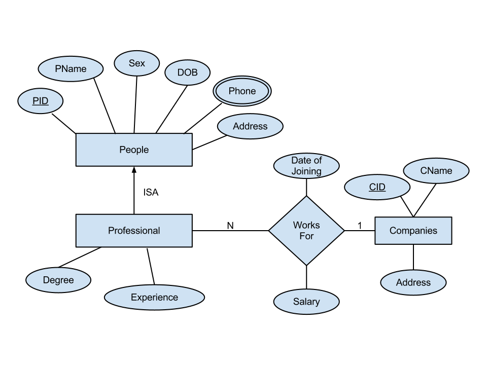
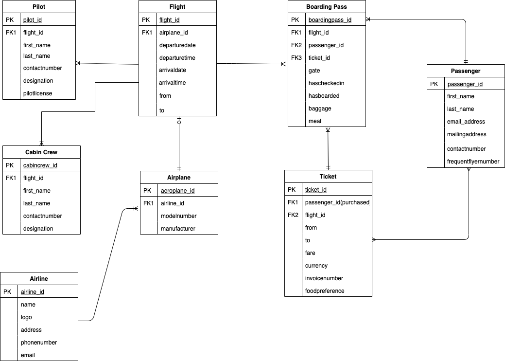

- [Introduction to Databases](#introduction-to-databases)
  - [Tables](#tables)
    - [Field Constraints](#field-constraints)
  - [Data Types](#data-types)
  - [Relational Schemas](#relational-schemas)
    - [Entity-Relationship Diagram](#entity-relationship-diagram)
    - [Schema Diagram](#schema-diagram)
    - [Keys](#keys)
- [SQL Theory](#sql-theory)
  - [Data Definition Language (DDL)](#data-definition-language-ddl)
  - [Data Manipulation Language (DML)](#data-manipulation-language-dml)
  - [Data Control Langauge (DCL)](#data-control-langauge-dcl)
  - [Transaction Control Language (TCL)](#transaction-control-language-tcl)
- [Data Definition](#data-definition)
  - [Creating Tables](#creating-tables)
  - [Modifying Fields](#modifying-fields)

---

# Introduction to Databases

Structured Query Language (SQL) is a declarative programming language that allows you to create,manipulate, and share data specifically from Relational Database Management Systems (RDBMS).

**Database:** Systematic collection of data.  Their main goal is to organize large amounts of data that can be quickly retrieved. They must **compact, well-structured, and efficient**.
- Data is stored in table records, not individual cells.
- All calculations and operations are done after data retrieval.

**Database Management System (DBMS):** A collection of programs that enables users to access a database, munipulate data, and helps in the representation of data.  It also helps control access to the database by various users.

**Query:** Piece of code inducing the computer to execute a certain operation that will deliver the desired output.

**Entity:** The smallest unit that can contain a meaningful set of data. E.g. a row (record) in a table represents its horizontal entity and a column (field) its vertical entity.

## Tables

Contain **fields** (columns) and **records** (rows) of data.
- Each field has a defined data type.
- Each field should contain only one value per record.
- Each row of sata should be unique.

### Field Constraints

1. **Unique:** Ensures that a field can only contain unique values.  Throws an error if a field contains duplicate values.
2. **Not Null:** Ensures that  a field cannot constain `NULL` values.
3. **Check:**  Ensures that data in a field satiisfies a specific `BOOLEAN` expression.

## Data Types

See here for a full list of [PostgeSQL data types](https://www.postgresql.org/docs/13/datatype.html).  The most common ones can be found below.

| Type | Description | Examples |
|-|-|-|
| `INT` | Whole number | Age, quantity |
| `NUMERIC(P,S)` | Arbitrary-precision numbers with P significant digits and S decimal places. | Height, price |
| `SERIAL` | Auto-incrementing integers | Not true types, merely notational convenience for creating unique id columns |
| `CHAR(N)` | Fixed length string of length N | Gender, state |
| `VARCHAR(N)` | Varying length string of max length N | Name, email |
| `TEXT` | Varying length string with no max length | Comments, reviews |
| `TIME` | HH:MM:SS | In military format |
| `DATE` | YYYY-MM-DD |  |
| `TIMESTAMP` | YYYY-MM-DD HH:MM:SS | Order time |
| `BOOLEAN` | True or false | In stock |
| `ENUM` | Values belonging to a user-defined list | Day of the week |

## Relational Schemas

Database designers will plot the entire database system using two common methods.

### Entity-Relationship Diagram


### Schema Diagram


### Keys

**Primary Key:** A field (or set of fields) whose value exists and is unique for every record in a table.
- The PK is the **unique identifier of a table** .  A table can have at most one PK
- The PK field(s) cannot contain `null` values

**Foreign Key:** A field (or set of fields) in one table, that refers to the primary key in another table.  The table with the FK is called the child table, and the table with the PK is called the parent table.
- FK's identify relationships between tables
- Preserve data integrity (cannot enter a value in the FK field that has not been declared in the parent table)

**Unique Key:**  Unique keys ensure that all values in a fiels are different.  A PK automatically has a unique constraint on it.
- May contain `null` values
- A table may have multiple unique keys

---

# SQL Theory

SQL's syntax comprises several types of statements that allow you to perform various commands and operations.

## Data Definition Language (DDL)

Statements that allow us to define or modify data structures and objects (e.g. the `CREATE` statement).

```sql
-- create a table with a single column
create table sales_data (purchase_number int);

-- add another column to it
alter table sales_data
add column date_of_purchase date;

-- rename the table
rename table sales_data to sales;

-- delete the table
drop table sales;

-- alternatively, just empty the table
truncate table sales;
```

## Data Manipulation Language (DML)

Statements that allow us to manipulate the data in a database (e.g. the `SELECT` statement is used to retrieve data from database objects).

```sql
-- retrieve entire table
select * from sales;

-- insert data into table
-- equivalent to INSERT INTO sales (purchase_number, date_of_purchase) VALUES (001, '2021-10-11');
insert into sales values (001, "2021-10-11");

update sales
set date_of_purchase_ = "2020-12-12"
where purchase = 1;
```

While the `TRUNCATE` statement removes all the records contained in the table, `DELETE` allows us to specify precisely what you would like removed.

```sql
delete from sales
where purchase_number = 1;
```

## Data Control Langauge (DCL)

Statements that allow us to manage the rights users have in a database.  You can `GRANT` OR `REVOKE` priviledges to users.  Both of these keywords have identical syntax.

```sql
-- GRANT syntax
grant permission_type
on database_name.table_name 
to "username"@"localhost"

-- the user Frank can only SELECT 
-- and only from the customers table in the database
create user "frank"@"localhost" identified by "password";
grant select on sales.customers to "frank"@"localhost";
```

## Transaction Control Language (TCL) 

The `COMMIT` statement will save the changes you've made, allowing other users to access the modified version.  It only works with changes related to the DML keywords `INSERT`, `DELETE`, and `UPDATE`.

```sql
update customers
set last_name = "Johnson"
where custumer_id = 4
commit;
```

Comitted statements cannot be udone.  However, the `ROLLBACK` clause reverts all changes since the last commit or rollback.

--- 

# Data Definition

To connect to your local database using from the command line, use the command `psql -U postgres -h localhost database_name`.  To connect to a specific database while already in psql, simply use the meta command `\c database_name`.

To create a new database use the following command:

```sql
create database database_name;
```

## Creating Tables

```sql
-- Parent table
CREATE TABLE DIRECTORS( director_id serial PRIMARY KEY,
                        first_name VARCHAR ( 30 ),
                        last_name VARCHAR ( 30 ) NOT NULL,
                        date_of_birth DATE,
                        nationality VARCHAR ( 20 ) );

-- Child table
CREATE TABLE MOVIES( movie_id serial PRIMARY KEY,
                     movie_name VARCHAR ( 50 ) NOT NULL,
                     movie_length INT,
                     release_date DATE,
                     -- FOREIGN KEY field
                     director_id INT REFERENCES DIRECTORS(director_id) );
```                     

A **junction table** maps two or more tables together by referencing the PK's of each data table. It contains a number of foreign keys, each in a many-to-one relationship from the junction table to the individual data tables. The PK of the junction table is typically composed of the FK columns themselves.

```sql
CREATE TABLE MOVIES_ACTORS( movie_id INT REFERENCES MOVIES(movie_id),
                            actor_id INT REFERENCES ACTORS(actor_id),
                            PRIMARY KEY ( movie_id, actor_id ) );
```

## Modifying Fields

To add a column we use the `ALTER` statement to add a column.  As always we have to define the field's data type and contatraints at the time of creation.

```sql
ALTER TABLE directors
ADD COLUMN email VARCHAR ( 50 ) UNIQUE,
ADD COLUMN age INT NOT NULL;
```

To modify a field's data type, you use the `ALTER` keyword both on the table and the column along with the  `TYPE` keyword.

```sql
ALTER TABLE directors
ALTER COLUMN nationality type CHAR ( 3 ),
ALTER COLUMN last_name type VARCHAR ( 50 );
```

Adding constraints on a field after its creation is a little bit more tricky and should be avoided through appropiate design.  For more information on how to do it [see here](https://www.cockroachlabs.com/docs/stable/add-constraint.html).

